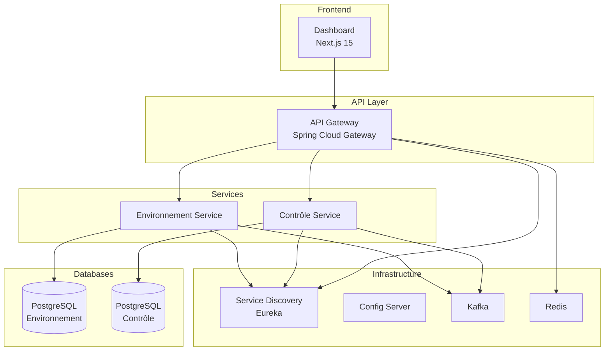

# 🌱 Greenhouse Management Microservices

A complete microservices-based system for monitoring and controlling greenhouse environments in real-time.

## 📋 Project Overview



### Key Features
- 🌡️ **Real-time Monitoring** - Temperature, humidity, CO2, light levels
- ⚡ **Automatic Control** - Automated responses to threshold breaches
- 📊 **Dashboard** - Live data visualization with SSE streaming
- 🔔 **Alert System** - Kafka-based event-driven notifications
- 🎛️ **Equipment Control** - Manage ventilators, heaters, irrigation

---

## 🛠️ Technology Stack

| Layer | Technology |
|-------|------------|
| **Frontend** | Next.js 15, React 18, TypeScript, Tailwind CSS |
| **API Gateway** | Spring Cloud Gateway, Redis (rate limiting) |
| **Services** | Spring Boot 3.2, Spring Cloud 2023.0 |
| **Messaging** | Apache Kafka |
| **Database** | PostgreSQL 15 |
| **Discovery** | Netflix Eureka |
| **Containerization** | Docker, Docker Compose, Kubernetes |

---

## 🚀 Quick Start

### Prerequisites
- Java 17+
- Node.js 20+
- Docker & Docker Compose
- Maven 3.8+

### Local Development (Docker Compose)

```bash
# 1. Clone repository
git clone https://github.com/mohamedlandolsi/greenhouse-management-system.git
cd greenhouse-management-system

# 2. Build services
mvn clean package -DskipTests

# 3. Start all services
docker compose --profile dev up -d

# 4. Access the application
```

| Service | URL |
|---------|-----|
| **Dashboard** | http://localhost:3000 |
| **API Gateway** | http://localhost:8080 |
| **Eureka** | http://localhost:8761 |
| **Kafka UI** | http://localhost:9093 |

### Kubernetes Deployment

```bash
# Deploy to development
./k8s/deploy.sh dev

# Deploy to production
./k8s/deploy.sh prod
```

---

## 📁 Project Structure

```
greenhouse-management-system/
├── api-gateway/              # Spring Cloud Gateway
├── service-discovery/        # Eureka Server
├── config-server/            # Centralized Configuration
├── environnement-service/    # Environmental Monitoring
├── controle-service/         # Equipment Control
├── greenhouse-dashboard/     # Next.js Frontend
├── k8s/                      # Kubernetes Manifests
│   ├── base/                 # Base configurations
│   └── overlays/             # Dev/Prod overlays
├── docs/                     # Documentation
├── docker-compose.yml
└── pom.xml
```

---

## 📚 Documentation

| Document | Description |
|----------|-------------|
| [API Documentation](docs/API_DOCUMENTATION.md) | REST API reference |
| [Deployment Guide](docs/DEPLOYMENT_GUIDE.md) | Production deployment |
| [Development Guide](docs/DEVELOPMENT_GUIDE.md) | Local setup & contributing |
| [Architecture Decisions](docs/ARCHITECTURE_DECISION_RECORDS.md) | Design rationale |
| [K8s README](k8s/README.md) | Kubernetes deployment |

---

## 🔌 API Overview

### Environnement Service (Port 8081)
| Endpoint | Method | Description |
|----------|--------|-------------|
| `/api/environnement/parametres` | GET/POST | Manage parameters |
| `/api/environnement/mesures` | GET/POST | Record measurements |
| `/api/environnement/mesures/alerts` | GET | Get alerts |

### Contrôle Service (Port 8082)
| Endpoint | Method | Description |
|----------|--------|-------------|
| `/api/controle/equipements` | GET/POST | Manage equipment |
| `/api/controle/actions` | GET/POST | Execute actions |

**Full API docs:** http://localhost:8080/swagger-ui.html

---

## 🧪 Testing

```bash
# Unit tests
mvn test

# Integration tests (requires Docker)
mvn verify

# Frontend tests
cd greenhouse-dashboard && npm test

# E2E tests
npm run test:e2e
```

**Coverage target:** 80%+

---

## 📊 Monitoring

| Endpoint | Description |
|----------|-------------|
| `/actuator/health` | Service health |
| `/actuator/metrics` | Prometheus metrics |
| `/actuator/info` | Build info |

---

## 🔐 Security

- **CORS** - Configured for frontend origins
- **Rate Limiting** - Redis-based via API Gateway
- **Network Policies** - K8s network segmentation
- **Secrets** - Kubernetes secrets / environment variables

---

## 🤝 Contributing

1. Fork the repository
2. Create feature branch: `git checkout -b feature/amazing-feature`
3. Commit changes: `git commit -m 'feat: add amazing feature'`
4. Push: `git push origin feature/amazing-feature`
5. Open a Pull Request

### Commit Convention
- `feat:` New feature
- `fix:` Bug fix
- `docs:` Documentation
- `refactor:` Code refactoring
- `test:` Adding tests

---

## 📄 License

This project is licensed under the MIT License.

---

## 👥 Authors

- **Mohamed Landolsi** - [GitHub](https://github.com/mohamedlandolsi)
