# 📋 Architecture Decision Records (ADR)

This document captures the key architectural decisions made for the Greenhouse Management System.

---

## ADR-001: Microservices Architecture

### Status
**Accepted**

### Context
We need to build a greenhouse monitoring and control system that:
- Handles real-time sensor data
- Controls multiple equipment types
- Provides a responsive dashboard
- Supports future scaling

### Decision
Adopt a microservices architecture with the following services:
- **Environnement Service** - Sensor data management
- **Contrôle Service** - Equipment control
- **API Gateway** - Unified entry point
- **Service Discovery** - Dynamic service registration

### Consequences
**Positive:**
- Independent scaling of services
- Technology flexibility per service
- Fault isolation
- Easier maintenance and deployment

**Negative:**
- Increased operational complexity
- Network latency between services
- Data consistency challenges
- More infrastructure to manage

### Alternatives Considered
1. **Monolithic** - Simpler but less scalable
2. **Serverless** - Good for sporadic loads, but we need continuous monitoring

---

## ADR-002: Event-Driven Communication with Kafka

### Status
**Accepted**

### Context
When sensor readings breach thresholds, the control system must react quickly and reliably.

### Decision
Use Apache Kafka for asynchronous event-driven communication:
- Topic: `greenhouse-alerts` - Alert events
- Topic: `measurement-stream` - Continuous measurements

```mermaid
graph LR
    ENV[Environnement Service] -->|Publish Alert| KFK[Kafka]
    KFK -->|Consume Alert| CTL[Contrôle Service]
    CTL -->|Execute Action| EQ[Equipment]
```



### Consequences
**Positive:**
- Decoupled services
- Reliable message delivery
- Event replay capability
- Scalable consumers

**Negative:**
- Added infrastructure complexity
- Message ordering challenges
- Learning curve for team

### Alternatives Considered
1. **REST webhooks** - Simpler but less reliable
2. **RabbitMQ** - Good but Kafka better for streaming/replay

---

## ADR-003: PostgreSQL for Persistence

### Status
**Accepted**

### Context
Each service needs reliable data storage with ACID compliance.

### Decision
Use PostgreSQL with:
- Database per service (loose coupling)
- JPA/Hibernate for ORM
- Liquibase for migrations (future)

### Consequences
**Positive:**
- Strong ACID guarantees
- Rich querying capabilities
- Excellent Spring Data integration
- Mature, well-documented

**Negative:**
- Horizontal scaling requires sharding
- Schema migrations need coordination

### Alternatives Considered
1. **MongoDB** - More flexible schema but weaker consistency
2. **TimescaleDB** - Good for time-series but adds complexity

---

## ADR-004: Spring Cloud Gateway

### Status
**Accepted**

### Context
We need a unified API entry point that handles:
- Request routing
- Load balancing
- Rate limiting
- CORS

### Decision
Use Spring Cloud Gateway with:
- Route definitions for each service
- Redis-backed rate limiting
- WebFlux for reactive handling

```yaml
routes:
  - id: environnement-service
    uri: lb://ENVIRONNEMENT-SERVICE
    predicates:
      - Path=/api/environnement/**
```

### Consequences
**Positive:**
- Native Spring ecosystem integration
- Reactive (non-blocking)
- Flexible filter chain
- Built-in circuit breaker support

**Negative:**
- Requires Redis for rate limiting
- Configuration complexity
- Single point of failure (needs HA)

### Alternatives Considered
1. **Kong** - Feature-rich but separate infrastructure
2. **Nginx** - Simple but less Spring integration
3. **Zuul** - Legacy, replaced by Gateway

---

## ADR-005: Next.js for Frontend

### Status
**Accepted**

### Context
Need a modern, performant frontend with:
- Real-time updates
- Server-side rendering for SEO
- TypeScript support
- Component-based architecture

### Decision
Use Next.js 15 with:
- App Router for routing
- Server-Sent Events (SSE) for real-time
- Tailwind CSS for styling
- TypeScript throughout

### Consequences
**Positive:**
- Excellent developer experience
- Built-in optimization
- Strong TypeScript support
- React ecosystem access

**Negative:**
- Node.js server required
- Build complexity
- Potential over-engineering for simple UIs

### Alternatives Considered
1. **Vite + React** - Simpler but no SSR
2. **Angular** - Enterprise-ready but heavier
3. **Vue/Nuxt** - Good but smaller ecosystem

---

## ADR-006: Server-Sent Events for Real-Time Updates

### Status
**Accepted**

### Context
Dashboard needs to display live sensor data without manual refresh.

### Decision
Use Server-Sent Events (SSE) over WebSockets:
- Unidirectional (server → client)
- Automatic reconnection
- HTTP/2 compatible
- Simple implementation

```typescript
// Frontend usage
const eventSource = new EventSource('/api/sse/stream');
eventSource.onmessage = (event) => {
  const data = JSON.parse(event.data);
  updateDashboard(data);
};
```

### Consequences
**Positive:**
- Simpler than WebSocket
- Works through proxies
- Native browser support
- Lower overhead

**Negative:**
- Unidirectional only
- Connection limits per browser
- No binary data support

### Alternatives Considered
1. **WebSocket** - Bidirectional but more complex
2. **Polling** - Simple but inefficient
3. **GraphQL Subscriptions** - Overkill for our needs

---

## ADR-007: Kubernetes for Production Deployment

### Status
**Accepted**

### Context
Production deployment needs:
- High availability
- Auto-scaling
- Easy rollbacks
- Resource management

### Decision
Use Kubernetes with Kustomize for environment overlays:
```
k8s/
├── base/           # Shared configs
└── overlays/
    ├── dev/        # Development
    └── prod/       # Production (3+ replicas, TLS)
```

### Consequences
**Positive:**
- Industry standard
- Self-healing
- Declarative configuration
- Rich ecosystem

**Negative:**
- Steep learning curve
- Operational overhead
- Requires cluster maintenance

### Alternatives Considered
1. **Docker Swarm** - Simpler but less features
2. **ECS/Fargate** - AWS-specific
3. **Nomad** - Good but smaller community

---

## ADR-008: Eureka for Service Discovery

### Status
**Accepted**

### Context
Services need to find each other dynamically without hardcoded addresses.

### Decision
Use Netflix Eureka:
- Each service registers on startup
- Gateway queries Eureka for routing
- Health checks for availability

### Consequences
**Positive:**
- Native Spring Cloud integration
- Client-side load balancing
- Self-preservation mode

**Negative:**
- Additional service to maintain
- Could use K8s DNS in pure K8s setup
- Netflix moving toward maintenance mode

### Alternatives Considered
1. **Consul** - More features but more complex
2. **K8s DNS** - Native but less visibility
3. **Zookeeper** - Heavyweight for this use case

---

## Decision Log Summary

| ADR | Decision | Status | Date |
|-----|----------|--------|------|
| 001 | Microservices Architecture | Accepted | 2024-01 |
| 002 | Kafka for Events | Accepted | 2024-01 |
| 003 | PostgreSQL | Accepted | 2024-01 |
| 004 | Spring Cloud Gateway | Accepted | 2024-01 |
| 005 | Next.js Frontend | Accepted | 2024-01 |
| 006 | SSE for Real-Time | Accepted | 2024-01 |
| 007 | Kubernetes Deployment | Accepted | 2024-01 |
| 008 | Eureka Discovery | Accepted | 2024-01 |
