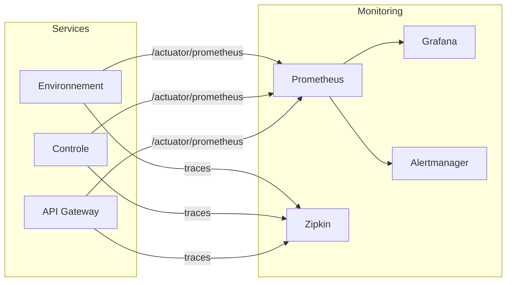

# 📊 Monitoring & Observability Guide

Guide for using the monitoring stack in the Greenhouse Management System.

---

## Quick Start

```bash
# Start all services with monitoring
docker compose --profile dev up -d

# Access monitoring tools
```

| Tool | URL | Credentials |
|------|-----|-------------|
| **Prometheus** | http://localhost:9090 | - |
| **Grafana** | http://localhost:3001 | admin/admin |
| **Zipkin** | http://localhost:9411 | - |
| **Alertmanager** | http://localhost:9094 | - |

---

## Architecture



---

## Grafana Dashboards

### 1. System Health Overview
- Service status (UP/DOWN indicators)
- Request rate per service
- Error rate percentage
- Response time P95

### 2. Business Metrics
- Measurement count by type (temperature, humidity, etc.)
- Alert frequency and trends
- Equipment activation counts
- Action success/failure rates

### 3. JVM Metrics
- Heap memory usage
- Garbage collection stats
- Thread count
- Database connection pool status

---

## Custom Metrics

| Metric | Type | Description |
|--------|------|-------------|
| `greenhouse_measurements_total` | Counter | Measurements by type |
| `greenhouse_alerts_total` | Counter | Alerts by type/severity |
| `greenhouse_equipment_activations_total` | Counter | Equipment activations |
| `greenhouse_action_execution_total` | Counter | Actions by status |
| `greenhouse_kafka_publish_duration` | Timer | Kafka publish latency |

### Query Examples

```promql
# Request rate per service
sum(rate(http_server_requests_seconds_count[5m])) by (job)

# Error rate percentage
sum(rate(http_server_requests_seconds_count{status=~"5.."}[5m])) 
/ sum(rate(http_server_requests_seconds_count[5m])) * 100

# 95th percentile response time
histogram_quantile(0.95, sum(rate(http_server_requests_seconds_bucket[5m])) by (le, job))

# Heap memory usage percentage
jvm_memory_used_bytes{area="heap"} / jvm_memory_max_bytes{area="heap"} * 100
```

---

## Distributed Tracing (Zipkin)

Traces flow automatically through all services via correlation IDs.

### Viewing Traces
1. Open http://localhost:9411
2. Click "Run Query" to see recent traces
3. Click on a trace to see span details

### Trace Propagation
- `X-B3-TraceId` - Trace identifier
- `X-B3-SpanId` - Span identifier
- Correlation IDs appear in logs as `[traceId,spanId]`

---

## Alerting

### Configured Alerts

| Alert | Condition | Severity |
|-------|-----------|----------|
| ServiceDown | Service unreachable for 1m | Critical |
| HighErrorRate | >5% errors for 5m | Warning |
| HighResponseTime | P95 >2s for 5m | Warning |
| JvmHeapMemoryHigh | >90% heap for 10m | Warning |
| DatabaseConnectionPoolExhausted | >90% connections for 5m | Critical |
| KafkaConsumerLag | >1000 messages for 10m | Warning |

### Alertmanager Configuration

Edit `monitoring/alertmanager/alertmanager.yml` to configure notifications:
- Slack webhooks
- Email
- PagerDuty
- Custom webhooks

---

## Log Aggregation

Logs are output in JSON format (production) with trace IDs:

```json
{
  "timestamp": "2024-01-01T10:30:00Z",
  "level": "INFO",
  "service": "environnement-service",
  "traceId": "abc123def456",
  "spanId": "789ghi",
  "message": "Measurement recorded",
  "logger": "com.greenhouse.environnement.service.MesureService"
}
```

---

## Actuator Endpoints

| Endpoint | Description |
|----------|-------------|
| `/actuator/health` | Liveness/readiness probes |
| `/actuator/health/liveness` | Liveness probe |
| `/actuator/health/readiness` | Readiness probe |
| `/actuator/prometheus` | Prometheus metrics |
| `/actuator/info` | Build information |
| `/actuator/metrics` | Available metrics |

---

## Troubleshooting

### Prometheus Not Scraping

```bash
# Check Prometheus targets
curl http://localhost:9090/api/v1/targets

# Check service metrics endpoint
curl http://localhost:8081/actuator/prometheus
```

### No Traces in Zipkin

1. Verify Zipkin is running: `docker logs greenhouse-zipkin`
2. Check service config: `zipkin.tracing.endpoint`
3. Verify sampling: `management.tracing.sampling.probability: 1.0`

### Grafana Dashboard Empty

1. Check Prometheus datasource in Grafana settings
2. Verify Prometheus is scraping: http://localhost:9090/targets
3. Check metric exists: Run query in Prometheus UI first

---

## Kubernetes Monitoring

For K8s deployments, ServiceMonitor CRDs are available:

```bash
# Apply ServiceMonitors (requires Prometheus Operator)
kubectl apply -f k8s/base/monitoring/
```
